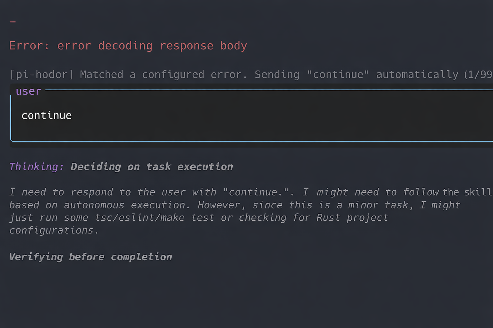

# pi-hodor

<p align="center">
  
</p>

[](https://www.npmjs.com/package/pi-hodor)
[](https://www.npmjs.com/package/pi-hodor)
[](./LICENSE)

`pi-hodor` is a pi extension that automatically sends a follow-up retry message when an assistant response stops in a retryable way.

It is useful when model output is interrupted by provider-side failures such as `ECONNRESET`, `ETIMEDOUT`, premature stream closure, or partial JSON responses. It can also continue when the assistant stops because it hit a length limit, or when it ends with a normal `stop` but only emitted thinking content and never produced user-visible text or tool calls. Instead of stopping and waiting for manual intervention, the extension detects these cases and sends a configurable retry message such as `continue`.

## Features

- Watches assistant messages that end with retryable stop reasons
- Automatically continues on `stopReason === "length"`
- Automatically continues on `stopReason === "stop"` when the assistant emitted only thinking content
- Matches `stopReason === "error"` text against configurable substring patterns
- Automatically sends a configurable retry message when a match is found
- Prevents runaway loops with a configurable retry limit
- Optionally shows UI notifications when an auto-retry happens
- Supports project-level and global config overrides without modifying the packaged files

## Installation

Install from npm:

```bash
pi install npm:pi-hodor
```

Or from git:

```bash
pi install git:github.com/vurihuang/pi-hodor
```

Restart pi after installation so the extension is loaded.

### Load it for a single run

```bash
pi -e npm:pi-hodor
```

### Install from a local path

```bash
pi install /absolute/path/to/pi-hodor
```

### Load from a local path for one session

```bash
pi -e /absolute/path/to/pi-hodor
```

## Verify installation

After restarting pi, the extension is active automatically.

You can confirm it is loaded by triggering a transient stream error during normal use, or by checking that the extension has been installed from npm and is available in your pi package list.

## Usage

Once the extension is loaded, there is nothing else to trigger manually.

When pi receives an assistant message that matches one of these conditions, `pi-hodor` automatically sends the configured retry message:

1. it ends with `stopReason === "error"` and its text matches one of the configured error patterns
2. it ends with `stopReason === "length"` and `autoContinueOnLength` is enabled
3. it ends with `stopReason === "stop"`, emitted thinking content, and emitted neither text nor tool calls, and `autoContinueOnThinkingOnlyStop` is enabled

The default retry message is:

```json
"continue"
```

## Setup command

If you want a reusable global config, run:

```text
/pi-hodor:setup
```

What this command does:

1. ensures the bundled default config exists inside the package
2. creates the global config directory if needed
3. copies the bundled default config to:
   `~/.pi/agent/extensions/pi-hodor/config.json`
4. does **not** overwrite the file if it already exists

So `/pi-hodor:setup` is a one-time bootstrap command for creating your editable global config file.

If the global config already exists, the command shows a warning and leaves your existing file unchanged.

## Configuration

Configuration is resolved in this order:

1. `./.pi-hodor.json`
2. `./.pi/pi-hodor.json`
3. `~/.pi/agent/extensions/pi-hodor/config.json`
4. the bundled `config.json` inside this package

That means:

- project config overrides global config
- global config overrides the packaged defaults
- packaged defaults are only used when no override file exists

Use project config when you want repo-specific behavior.
Use the global config when you want the same defaults across all projects.

### Path details

#### 1. Project config in repo root

```text
./.pi-hodor.json
```

Best for a single repository.

#### 2. Project config in `.pi`

```text
./.pi/pi-hodor.json
```

Also project-scoped, useful if you prefer keeping pi-related files together.

#### 3. Global config

```text
~/.pi/agent/extensions/pi-hodor/config.json
```

Best for personal defaults shared across projects.
You can generate this file with `/pi-hodor:setup`.

#### 4. Bundled fallback config

The package ships with its own `config.json`, which acts as the final fallback when no project or global override exists.

### Example flow

- You install `pi-hodor`
- You run `/pi-hodor:setup`
- The extension creates `~/.pi/agent/extensions/pi-hodor/config.json`
- You edit that file to define your global defaults
- In one specific repo, you add `./.pi-hodor.json`
- That repo now uses its local config instead of your global one

### Example config


```json
{
  "enabled": true,
  "retryMessage": "continue",
  "maxConsecutiveAutoRetries": 99,
  "notifyOnAutoContinue": true,
  "autoContinueOnLength": true,
  "autoContinueOnThinkingOnlyStop": true,
  "errorPatterns": [
    "error decoding response body",
    "stream disconnected before completion",
    "ECONNRESET"
  ]
}
```

### Config fields

| Field | Type | Description |
| --- | --- | --- |
| `enabled` | `boolean` | Enables or disables the extension logic. |
| `retryMessage` | `string` | The exact user message sent back to pi after a matched error. |
| `maxConsecutiveAutoRetries` | `number` | Maximum automatic retries before the extension stops retrying. |
| `notifyOnAutoContinue` | `boolean` | Shows a UI notification when an automatic retry happens or when the retry limit is reached. |
| `autoContinueOnLength` | `boolean` | Automatically retries when an assistant message ends with `stopReason === "length"`. |
| `autoContinueOnThinkingOnlyStop` | `boolean` | Automatically retries when an assistant message ends with `stopReason === "stop"` after emitting only thinking content and no text or tool calls. |
| `errorPatterns` | `string[]` | Case-insensitive substrings used to detect transient failures for `stopReason === "error"`. |

## Development

Install dependencies:

```bash
npm install
```

Run the type check:

```bash
npm run check
```

Preview the npm package contents:

```bash
npm run pack:check
```

## Package structure

```text
.
├── config.json
├── index.ts
├── LICENSE
├── package.json
├── README.md
└── tsconfig.json
```

## Updating

Reinstall the package from npm:

```bash
pi install npm:pi-hodor
```

Or update from git:

```bash
pi install git:github.com/vurihuang/pi-hodor
```

Restart pi after updating.

## Install as a pi package

This project is already structured as a pi package via the `pi` field in `package.json`:

```json
{
  "pi": {
    "extensions": ["./index.ts"]
  }
}
```

That means pi can install it from a local path, npm, or git using the standard pi package flow.
